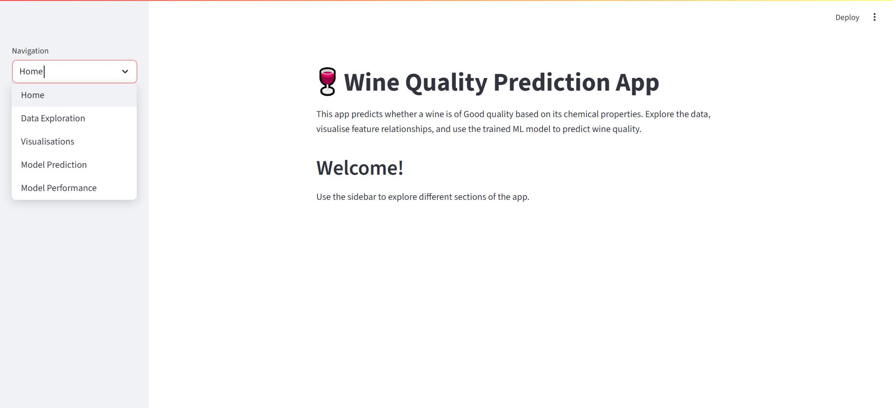

# 🍷 Wine Quality Prediction App
A machine learning–powered web application built with **Streamlit** that predicts whether a red wine is of **good** or **bad** quality based on its chemical properties.  
The model is trained on the **Wine Quality Red Dataset** from the UCI Machine Learning Repository.

## 📌 Features
- **Data Exploration**: View dataset shape, column types, sample rows, and filter by alcohol level  
- **Visualisations**: Histogram, Correlation Heatmap, and Alcohol vs Quality Boxplot  
- **Model Prediction**: Input wine properties and get a real-time quality prediction with confidence score  
- **Model Performance**: Accuracy score, classification report, and confusion matrix  

## 🔍 Model Details
The model is a **supervised classification model** trained on the following chemical properties:

- Fixed Acidity  
- Volatile Acidity  
- Citric Acid  
- Residual Sugar  
- Chlorides  
- Free Sulfur Dioxide  
- Total Sulfur Dioxide  
- Density  
- pH  
- Sulphates  
- Alcohol  

Performance metrics can be found in the **Model Performance** section of the app.

## 🌐 Deployment

The app is deployed on **Streamlit Cloud**.  
You can access the live version here:  
👉 *https://wine-quality-prediction-bz6fpjcudbhpbmduwbulzk.streamlit.app/*
